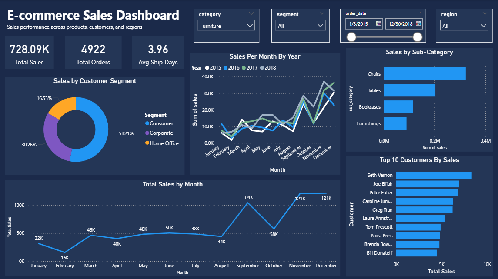
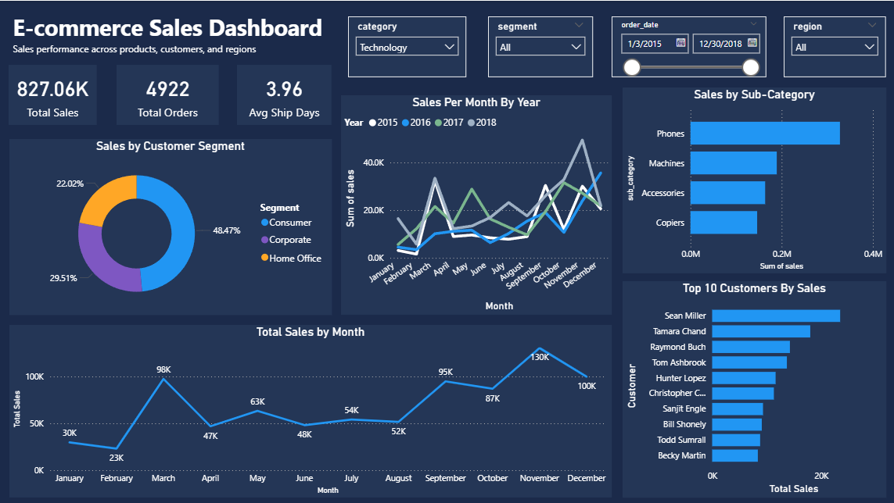
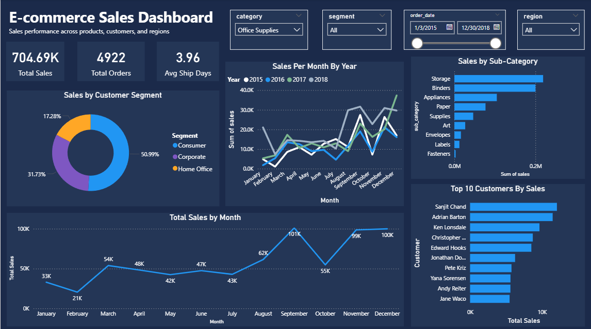

# E-commerce Sales Analytics Dashboard
A sales analytics dashboard built with PostgreSQL and Power BI, analyzing 
e-commerce sales data sourced from Kaggle to uncover trends in revenue, 
customer behavior, and product performance.

## Project Structure
├── sql/
│   ├── create_staging.sql        # Raw data staging table
│   ├── create_tables.sql         # Relational schema
│   ├── staging_to_relational.sql # ETL transformation
│   └── queries.sql               # Analysis queries
├── powerbi/
│   └── ecommerce_dashboard.pbix  # Power BI report file
└── images/
    └── dashboard_screenshots/    # Dashboard previews

## Dashboard Overview
This dashboard analyzes 4,922 orders and $2.26M in total sales across 
four years (2015–2018). It provides interactive filtering by category, 
customer segment, region, and date range.

**Key Insights:**
- Consumer segment drives 51% of total revenue
- November is consistently the strongest sales month across all years
- Chairs are the top performing sub-category in Furniture
- 2018 shows consistent year-over-year growth compared to 2017
- Average shipping time is 3.96 days across all ship modes

## Data Source
Data sourced from [Kaggle](https://www.kaggle.com/datasets/rohitsahoo/sales-forecasting?resource=download) — Superstore 
Sales Dataset. Contains order, customer, product, and location data 
across US e-commerce transactions from 2015 to 2018.

## Database Schema
The raw CSV was first loaded into a staging table, then transformed 
into a normalized relational schema with the following tables:

- **customers** — customer ID, name, and segment
- **locations** — postal code, city, state, region, and country
- **products** — product ID, name, category, and sub-category
- **orders** — order ID, dates, ship mode, and foreign keys
- **order_items** — order/product relationships and sales amounts

## Setup
1. Run `create_staging.sql` to create the raw staging table
2. Import your CSV into the staging table
3. Run `create_tables.sql` to build the relational schema
4. Run `staging_to_relational.sql` to transform and load the data
5. Run `queries.sql` to explore and validate the data
6. Open `ecommerce_dashboard.pbix` in Power BI Desktop and update 
   the data source connection to your PostgreSQL instance

> Note: Power BI Desktop (free) is required to open the .pbix file.

## Dashboard Preview

### Full Dashboard (All Categories)

### Furniture Category Filter Applied

### Technology Category Filter Applied

### Office Supplies Category Filter Applied

## Tools Used
- **PostgreSQL** — data storage and transformation
- **Power BI Desktop** — dashboard and visualizations
- **SQL** — ETL pipeline, schema design, and analysis queries